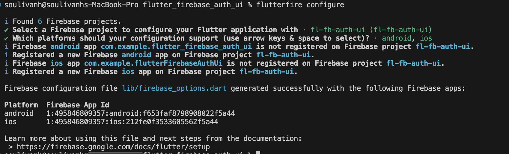
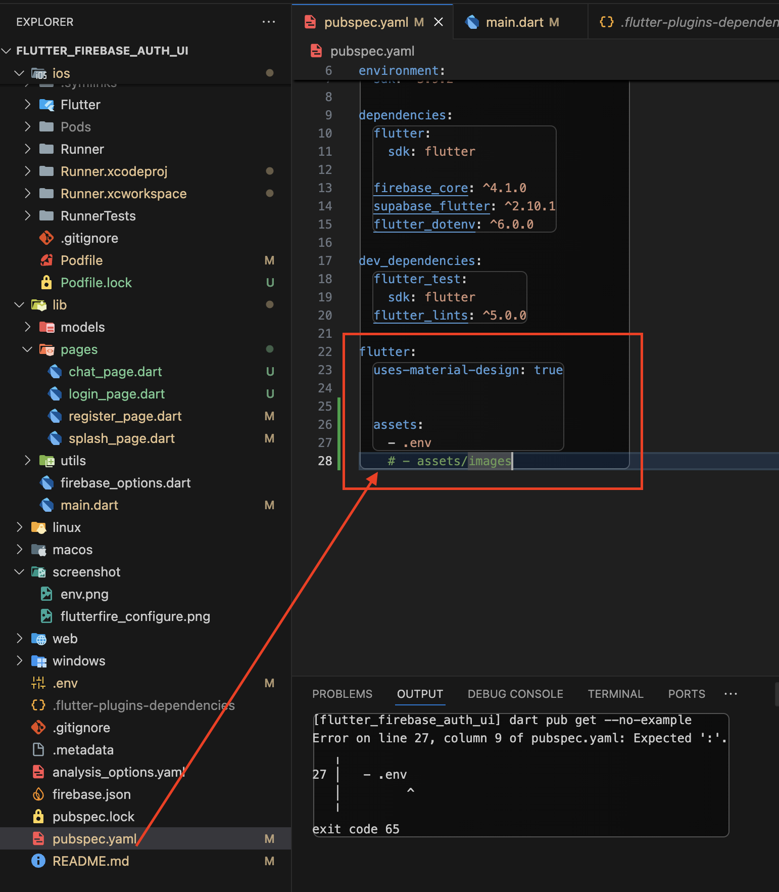
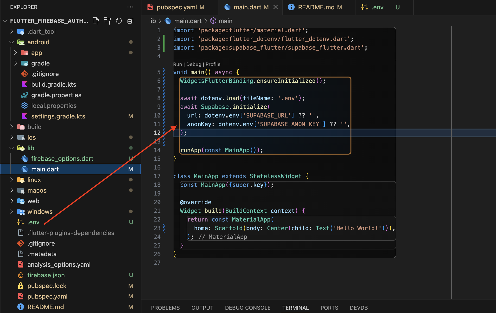

# flutter_firebase_auth_ui

A new Flutter ChatApp project. 
Flutter + firebase + powersync + supabase
https://www.youtube.com/watch?v=EmtOfiELasY

A new Flutter project.
```
flutter create -e flutter_firebase_auth_ui --org=com.ifundev
```
## Vscode extension
1. blockman
2. flutter snippets
3. codeium (ai code), copilot
4. dart data class generator
5. flutter & Dart Utilities
6. flutter riverpod snippets
7. flutter widget snippets
8. material icon theme
9. error lens
10. todo tree
11. pubspec assist ( Ctrl+Shift+P on Windows, ⌘+Shift+P on Mac) and search for "Pubspec Assist" and type packgage name)
12. image preview

## connect flutter project to firebase on terminal

1. install firebase tool
```
brew tap firebase/tap
brew install firebase-cli
flutterfire --version
firebase projects:list --json
sudo gem install xcodeproj
sudo gem update --system
```
2. connection
```
firebase login
flutterfire configure
```


## scure your key
from evn file
https://www.youtube.com/watch?v=1IC3oSEI8LQ
1. install package: flutter_dotenv
2. create env
3. link .env to pubspecs.yaml
assets:
  - .env
  # - assets/images
  
4. usage env
